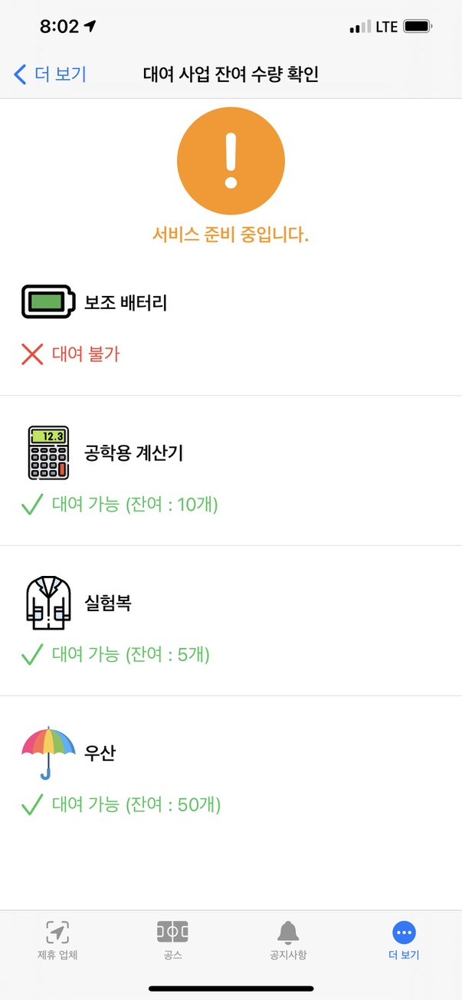

 
# JBNU COE 
### An official mobile application of College of Engineering, Jeonbuk National University Student Council. get notice and welfare for fastest 
ⓒ 2021-2024. Changjin Ha. All Rights Reserved.  

## Features 
#### Associate Stores 
> List of affiliates, location, benefits, representative menus, and everything from one touch to the phone. 

 

#### Notice 
> The quickest way to check student council announcements 

 

#### Remaining quantity of rental items 
> Even if you don't come to the student council room, check the items and rental records at a glance in real time 

 

#### Campus Map 
> How to forget how to get lost 

 

#### Sports mercenary system 
> Looking for someone to work out with anytime, anywhere 

 

#### HandWriting 
> A peek at the successful candidate's secret 

 

#### Delivery agent receipt 
> Delivery that is difficult to receive in person, now register through the app and visit when you have time 

 

#### Real-time pledge fulfillment rate 
> Student council's promise fulfillment rate in real time 

 

#### Feedback Hub 
> From school facilities to apps, now make it with your ideas 

 

## Compatibility 
> JBNU COE is compatible with these devices.  
### iPhone 

> iPhone 15 Pro Max  
 iPhone 15 Pro  
 iPhone 15 Plus  
 iPhone 15  
 iPhone 14 Pro Max  
 iPhone 14 Pro  
 iPhone 14 Plus  
 iPhone 14  
 iPhone SE (3rd-Generation)  
 iPhone 13 Pro Max  
 iPhone 13 Pro  
 iPhone 13  
 iPhone 13 mini  
 iPhone 12 Pro Max  
 iPhone 12 Pro  
 iPhone 12  
 iPhone 12 mini  
 iPhone SE (2nd-Generation)  
 iPhone 11 Pro Max  
 iPhone 11 Pro  
 iPhone 11  
 iPhone Xs Max  
 iPhone Xs  
 iPhone XR  
 iPhone X  
 iPhone 8 Plus  
 iPhone 8  
 iPhone 7 Plus  
 iPhone 7  
 iPhone SE  
 iPhone 6s Plus  
 iPhone 6s  

### iPad 

> iPad Pro 12.9 (6th-Generation)  
 iPad Pro 11 (4th-Generation)  
 iPad Pro 12.9 (5th-Generation)  
 iPad Pro 11 (3rd-Generation)  
 iPad Pro 12.9 (4th-Generation)  
 iPad Pro 11 (2nd-Generation)  
 iPad Pro 12.9 (3rd-Generation)  
 iPad Pro 11  
 iPad Pro 12.9 (2nd-Generation)  
 iPad Pro 10.5  
 iPad Pro 12.9 (1st-Generation)  
 iPad Pro 9.7  
 iPad Air (5th-Generation)  
 iPad Air (4th-Generation)  
 iPad Air (3rd-Generation)  
 iPad Air 2  
 iPad mini (6th-Generation)  
 iPad mini (5th-Generation)  
 iPad mini 4  
 iPad (10th-Generation)  
 iPad (9th-Generation)  
 iPad (8th-Generation)  
 iPad (7th-Generation)  
 iPad (6th-Generation)  
 iPad (5th-Generation)  

 * Required iOS/iPadOS 14.1 or up.  
 * 500MB or higher storage required for install application.

